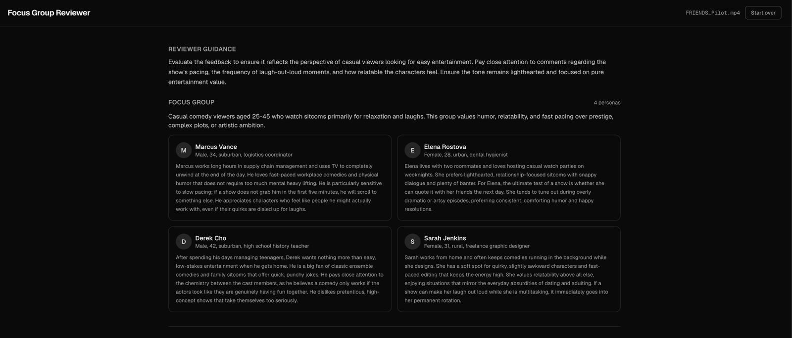
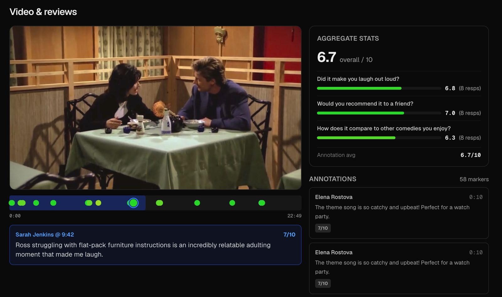
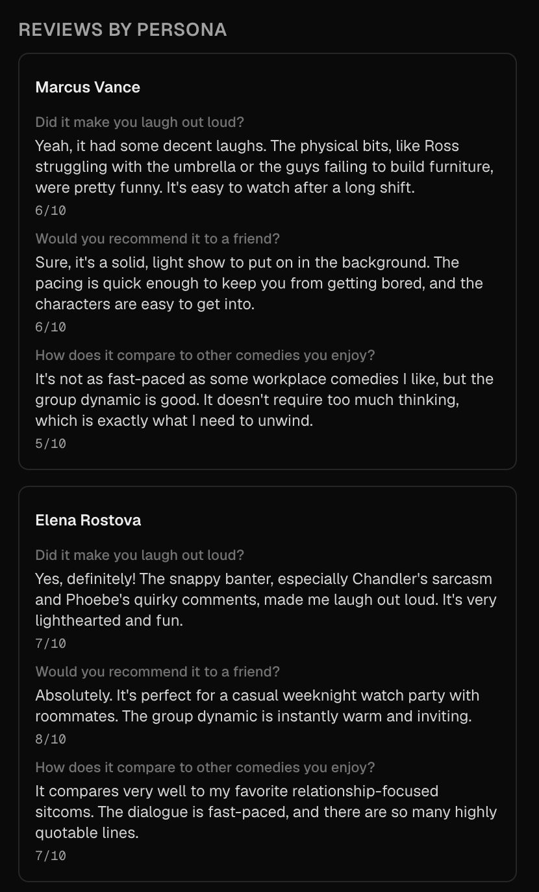

# Bazaar

Bazaar is an AI focus group for video feedback.

Users upload an MP4, describe the audience they want feedback from, list the questions they care about, and Bazaar creates a panel of AI personas matching that target group. Each persona watches the video independently, answers the survey questions, leaves timestamped annotations, and gives scored reactions.

The goal was simple: can we approximate the early signal of a real focus group without having to recruit, schedule, and pay a panel of people every time?

## Motivation

TV pilots, ads, lectures, demos, and product videos are often reviewed by focus groups before people decide whether to invest more time and money into them. That process is useful, but it is slow and expensive.

LLMs are not a replacement for real people. But they are trained on a huge amount of human-written reactions, opinions, criticism, and discussion. That makes them interesting tools for early feedback. The bet behind this project was that if we create believable personas and ask them to review a video from their own point of view, we can get a useful first pass on how different audience segments may react.

Bazaar is not trying to tell you the truth. It is trying to give you structured, cheap, fast signal before you spend real money on a real audience.

## What We Built

The app lets a user:

1. Upload an MP4 video.
2. Describe the focus group they want, including the kind of diversity and viewpoints they care about.
3. Ask specific survey questions.
4. Watch the AI focus group get created in real time.
5. See persona-level reviews, timestamped video annotations, and aggregate scores.

The final output includes:

1. A compiled review brief extracted from the user's prompt.
2. A generated focus group of distinct AI personas.
3. One structured review per persona.
4. Timestamped comments attached to the video timeline.
5. Scores per answer and per annotation.
6. Aggregate stats across the focus group.

The most useful part of the product is the timeline. Instead of only getting a wall of text, you can click a persona's annotation and jump to the exact part of the video they reacted to.

## Product Walkthrough

Bazaar first turns the user's prompt into review guidance and a generated focus group. This gives the user a quick way to check whether the agent understood the intended audience before reading the reviews.



The video review screen is the core experience. Personas leave timestamped annotations on the video, and each marker can be clicked to jump to the exact moment that triggered the reaction.



Each persona also answers the survey questions from their own point of view, which makes it easier to compare how different audience members reacted to the same video.



## What We Achieved

By the end, we had a working end-to-end prototype:

1. Video upload and caching works.
2. User prompts are converted into structured review instructions.
3. Personas are generated from the requested focus group.
4. Reviews run independently for each persona.
5. The UI streams progress and updates as the agent state changes.
6. The final screen shows review guidance, personas, annotations, answers, and aggregate ratings.

The setup is solid. The agent architecture is clean enough that the quality of results can now mostly be improved by better prompts, better evaluation, and tighter product constraints.

The biggest learning was that the infrastructure is not the hard part. The hard part is prompting the model so the personas feel distinct, the annotations stay grounded in the actual video, and the answers feel like believable audience feedback instead of generic LLM output. With stronger prompting and more iteration on templates, the results could be a lot better.

## Architecture

The project has two main pieces:

1. `agent/`: the backend agent, API, state model, prompt management, and video caching.
2. `client/`: the Next.js frontend for uploading videos, describing the focus group, and viewing results.

Most of the heavy lifting happens in `agent/`.

### Agent Flow

The agent is implemented as a LangGraph state graph in `agent/graph.py`.

The graph has four nodes:

1. `prepare_input`: converts the user's free-text prompt into structured `AgentInput`.
2. `create_focus_group`: creates the requested number of personas.
3. `review_content`: fans out across personas so each one reviews the cached video independently.
4. `eval_reviews`: marks the run complete.

The graph state is defined in `agent/state.py`. The important models are:

1. `AgentInput`: focus group description, persona count, questions, and reviewer guidance.
2. `Persona`: generated reviewer identity with name, bio, and demographics.
3. `ContentReview`: one persona's answers and timestamped annotations.
4. `AgentState`: the full run state, including user prompt, cached video key, personas, reviews, and completion status.

LangGraph's `Send` API is used to fan out `review_content` calls, one per persona. The reviews are merged back into the shared state using an additive `reviews` field.

### API

The API is implemented in `agent/api.py` with FastAPI.

Endpoints:

1. `POST /content/cache-video`: accepts an uploaded MP4 and caches it for model calls.
2. `POST /agent/invoke`: starts a new agent run using the user's prompt and cached video name.
3. `GET /agent/state/updates`: streams agent state updates over server-sent events.

`ApplicationLang` owns the content library, compiled graph, and in-flight tasks. Each run gets a UUID `run_id`, which is also used as the LangGraph thread ID so state can be retrieved while the run is executing.

### Video Caching

`agent/storage.py` handles video upload and caching.

The uploaded MP4 is sent to the model provider's file API, the backend waits for processing to complete, and then creates a cached content object with a one-hour TTL. The cache name is passed into the review node so each persona can review the same video without re-uploading it.

This matters because videos are large. Caching makes the review step practical and keeps the focus group fan-out from duplicating upload work.

### Prompt Template Version Management

Prompts live in `templates/`:

1. `templates/prepare_input.hbs`
2. `templates/create_focus_group.hbs`
3. `templates/review_content.hbs`

`agent/prompt_manager.py` is responsible for storing and retrieving prompt templates from an external prompt registry. The tests in `tests/test_prompt_manager.py` show the workflow for publishing templates and getting back version IDs.

The agent nodes do not load templates directly from disk at runtime. Instead, `GeminiAgentGraphNodes` references fixed prompt version IDs:

1. `prepare_input_prompt_version_id()`
2. `create_focus_group_prompt_version_id()`
3. `review_content_prompt_version_id()`

That gives us explicit template versioning. A run is tied to a known prompt version, and new prompt experiments can be published without silently changing the behavior of the agent. Once a new template version is validated, the corresponding version ID can be updated in `agent/nodes.py`.

### Frontend

The frontend is a small Next.js app in `client/`.

It handles:

1. MP4 upload and caching through `client/src/lib/api.ts`.
2. Prompt collection through `PromptForm`.
3. State streaming through server-sent events.
4. Persona and guidance display.
5. Video playback with clickable annotation markers.
6. Aggregate score calculation in `client/src/lib/aggregate.ts`.

The frontend is intentionally thin. It mostly displays the agent state and adds a useful video review interface on top of it.

## Local Development

Backend setup:

```shell
poetry env use python3.10
eval $(poetry env activate)
poetry install
```

Run the backend API:

```shell
python -m agent.api --port 9384
```

Frontend setup:

```shell
cd client
pnpm install
pnpm dev
```

The frontend defaults to `http://localhost:9384` for the API. You can override it with `NEXT_PUBLIC_API_BASE_URL`.

## Environment

The backend expects credentials and configuration for the model provider, video caching, and prompt registry. Configure those values in your shell before starting the API.

## Final Notes

This is a weekend project, but the core idea works: describe an audience, upload a video, and get structured reactions from a generated focus group.

The quality ceiling is mostly in the prompts now. Better persona generation, stronger grounding instructions, more robust self-evaluation, and more specific question design would likely produce much better reviews. The architecture is already in a good place for that kind of iteration.
